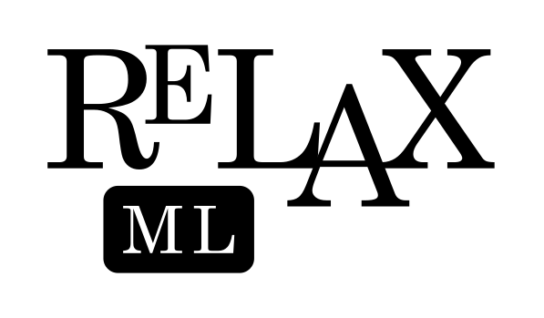

<div>
   <picture>
      <source media="(prefers-color-scheme: light)" srcset="relaxML-logo-light.svg">
      <source media="(prefers-color-scheme: dark)" srcset="relaxML-logo-dark.svg">   
      
   </picture>
</div>

A personal markup language for recreational purposes.

## Building

Install the following dependencies (Make sure these are added to PATH):

- [Git](https://git-scm.com/)
- [Java Development Kit](https://www.oracle.com/java/technologies/downloads/)
- [Launch4j](https://launch4j.sourceforge.net/)

1. Clone the source with `git`:

   ```sh
   git clone https://github.com/sugartax/relaxML
   cd relaxML
   ```

2. Create a `.jar` file (Make sure to add all the .class files):

   ```sh
   javac Main.java
   jar cfm relaxML.jar MANIFEST.MF Main.class Options.class ...etc
   ```

3. Create a `relaxML-build.xml` file:

   See [XML.md](XML.md) for instructions.

4. Use `Launch4j` to create an executable:

   ```sh
   launch4jc relaxML-build.xml
   ```

## Usage

See [Docs](https://example.com) for documentation on ReLaX ML.
